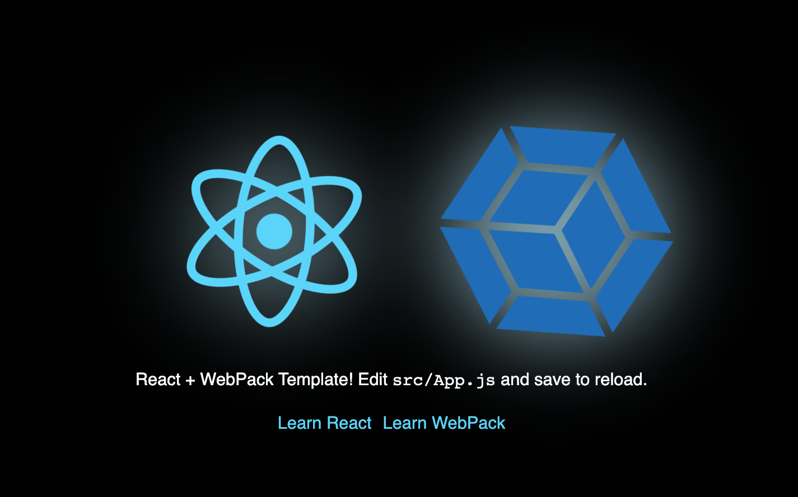

<h1 align="center">
  React + Webpack Template
</h1>

<p align="center">
    A <a href="https://react.dev">React</a> + <a href="https://webpack.js.org/">Webpack</a> starter template.
</p>


<p>&nbsp;</p>

# How to configure webpack from scratch

**_Create a new directory for your project and navigate to it in your terminal._**

## Follow up the steps!

## 1. Initialize a new npm package by running the following command in your terminal and following the prompts:

```
npm init
```

## 2. Now you will need to install the necessary dependencies for the project by running the following command in your terminal:

```
npm install --save react react-dom
```

## 3. we are installing all the necessary dependencies at once!

```
npm install --save-dev webpack webpack-cli webpack-dev-server babel-loader @babel/core @babel/preset-env @babel/preset-react css-loader style-loader eslint eslint-config-prettier eslint-plugin-prettier eslint-plugin-react prettier
```

### Note: This will install `React`, `React-DOM`, `Webpack`, `Webpack` `CLI`, `Webpack` `Dev` `Server`, `Babel`, `ESLint`, `Prettier`, and some `loaders` and `plugins`.

## 4. Now Create a new file called `webpack.config.js` in the root of your project with the following contents:

`webpack.config.js`

```const path = require('path');

module.exports = {
  entry: './src/index.js',
  output: {
    path: path.resolve(__dirname, 'dist'),
    filename: 'bundle.js',
  },
  module: {
    rules: [
      {
        test: /\.(js|jsx)$/,
        exclude: /node_modules/,
        use: {
          loader: 'babel-loader',
        },
      },
      {
        test: /\.css$/,
        use: ['style-loader', 'css-loader'],
      },
    ],
  },
  devServer: {
    static: {
      directory: path.join(__dirname, 'public'),
    },
    port: 3000,
    hot: true,
  },
};

```

<h3>After that </h3>

## 5. Create a new file called `.babelrc` in the root of your project with the following contents:

`.babelrc`

```
{
  "presets": ["@babel/preset-env", "@babel/preset-react"]
}
```

This will set up Babel to use the `@babel/preset-env` and `@babel/preset-react presets`

## 6. Create a new file called .eslintrc.json in the root of your project with the following contents:

```.eslintrc

```

```
{
  "extends": [
    "eslint:recommended",
    "plugin:react/recommended",
    "plugin:prettier/recommended"
  ],
  "plugins": ["react", "prettier"],
  "rules": {
    "prettier/prettier": "error"
  },
  "parserOptions": {
    "ecmaFeatures": {
      "jsx": true
    },
    "sourceType": "module",
    "ecmaVersion": 2020
  },
  "env": {
    "browser": true,
    "es6": true
  }
}

```

## 7. Create a new file called .prettierrc in the root of your project with the following contents:

`prettierrc`

```
{
  "semi": true,
  "trailingComma": "es5",
  "singleQuote": true,
  "printWidth": 80,
  "tabWidth": 2,
  "arrowParens": "avoid",
  "endOfLine": "auto"
}

```

## 8. Update your package.json file with the following scripts:

`package.json`

```
"scripts": {
  "start": "webpack serve --mode development --open",
    "build": "webpack --mode production",
    "test": "echo \"Error: no test specified\" && exit 1",
    "lint": "eslint --fix --ext .js,.jsx,.ts,.tsx src/**/*.{js,jsx,ts,tsx}"
},
```

## 9. Run npm start in your terminal to start the development server.

```
npm start
```
